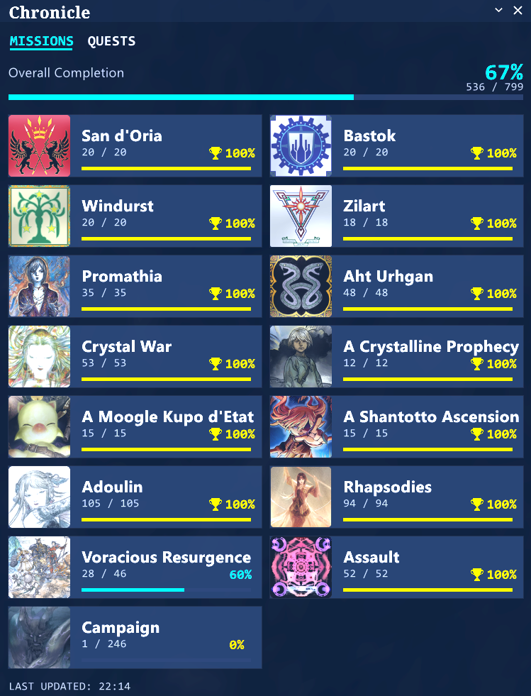
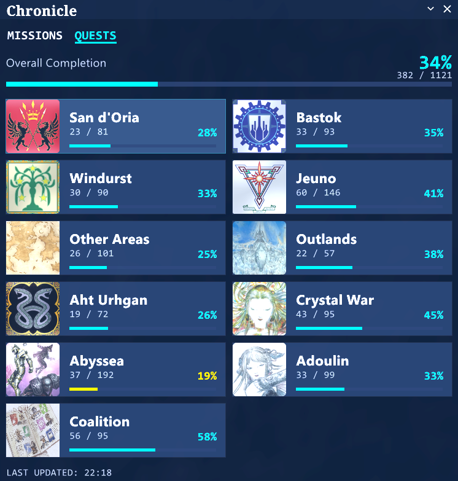
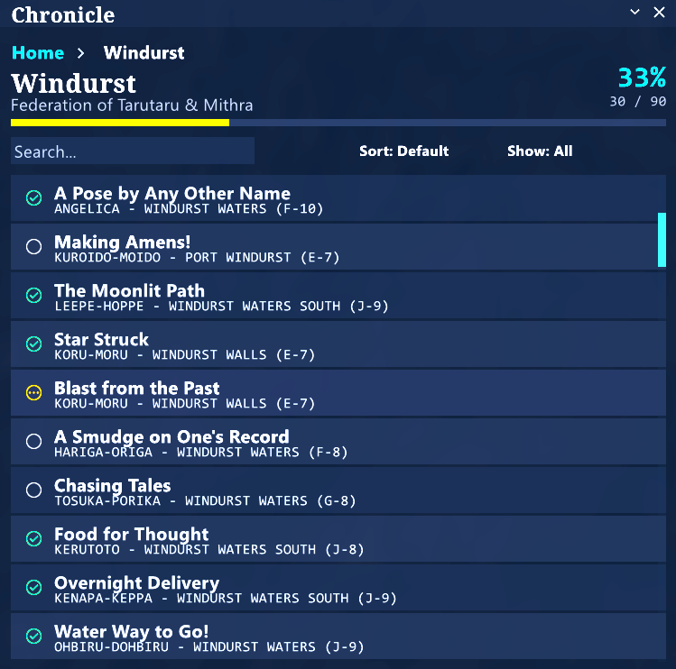
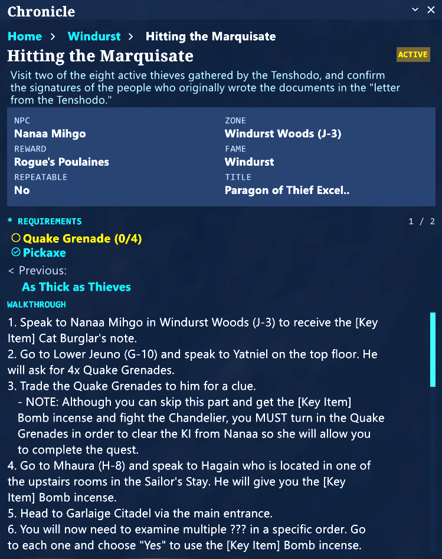

# Chronicle

A visual quest and mission tracker for Final Fantasy XI. Chronicle shows your completion progress across all quest areas and mission storylines, lets you browse entries with search and filters, and provides detailed guides with live inventory checking — all inside an interactive, clickable UI.



## Features

- **Track quest completion** across all 11 quest areas with progress bars and percentages
- **Track mission completion** across 15 mission storylines (nation missions, expansion storylines, add-on scenarios, Assault, and Campaign)
- **Tabbed home view** — switch between Mission and Quest tabs to see overall progress for each category
- **Search and filter** entries by name, completion status, or sort order
- **Detailed guides** with start NPC, zone, rewards, fame requirements, and step-by-step walkthroughs
- **Live requirements checking** — see which items and key items you already own and which you still need
- **Quest/mission chain navigation** — click through Previous/Next links to follow multi-part chains
- **Scalable UI** — resize from 0.5x to 3.0x to suit your screen
- **Draggable and collapsible** window with per-character saved positions

## Installation

Copy the `chronicle` folder into your `Windower/addons/` directory, then load it in-game:

```
//lua load chronicle
```

To autoload on every login, add the line above to your `scripts/init.txt` file.

## Usage

Toggle the window with:

```
//cr
```

### Navigation

Chronicle uses a drill-down layout with three views. A breadcrumb bar at the top of the window lets you navigate back at any time.

#### Home View

The home screen has two tabs — **Missions** and **Quests** — letting you switch between the two categories. Each tab shows your overall completion and a grid of area cards. Each card displays the area name, number of completed entries, completion percentage, and a colour-coded progress bar. Click any card to drill into that area.



#### Area View

The area view lists every quest or mission in the selected area. Each row shows the entry name, start NPC (for quests), and a status indicator. A toolbar at the top provides:

- **Search** — type to filter by name in real time
- **Sort** — order by Default (game ID), Name (alphabetical), or Status (active first)
- **Show** — filter to All, Completed, or Todo

Click any row to open its guide.



#### Guide View

The guide view shows everything you need to complete a quest or mission:

- **Status badge** — Completed, Active, Not Started, or Repeatable
- **Metadata** — Start NPC, zone with coordinates, reward, fame requirement, title, and repeatable status
- **Requirements checklist** — items and key items needed, with live OWNED/MISSING status pulled from your inventory, satchel, sack, case, wardrobe, safe, storage, and temporary items
- **Chain links** — clickable Previous and Next links to follow multi-part quest chains or mission storylines
- **Walkthrough** — step-by-step guide text (sourced from BG Wiki)
- **Notes** — additional tips where available



## Commands

| Command | Description |
|---|---|
| `//cr` | Toggle the window |
| `//cr show` | Show the window |
| `//cr hide` | Hide the window |
| `//cr compact` | Toggle collapsed/expanded mode |
| `//cr home` | Navigate to the home view |
| `//cr reset` | Reset window position to default |
| `//cr refresh` | Rebuild the UI with current data |
| `//cr size` | Show current UI scale |
| `//cr size +` / `//cr size -` | Increase or decrease scale by 0.1 |
| `//cr size <number>` | Set scale directly (0.5 to 3.0) |
| `//cr size reset` | Reset scale to 1.0 |
| `//cr autoshow` | Toggle auto-show on login |
| `//cr q` | Print quest summary to chat |
| `//cr q <area>` | Print quest detail for an area to chat |
| `//cr m` | Print mission summary to chat |
| `//cr m <area>` | Print mission detail for an area to chat |
| `//cr help` | Show help text in chat |

## Settings

Settings are saved per-character and persist between sessions. The following are stored automatically:

- **Window position** — drag the title bar to reposition
- **UI scale** — adjusted via `//cr size`
- **Sort and filter modes** — last-used sort order and show filter
- **Active tab** — whether the home view defaults to Missions or Quests
- **Visibility and collapse state** — whether the window is shown and/or collapsed on load

Settings are stored in `addons/chronicle/data/settings.xml`.

## Quest Areas

Chronicle covers all 11 quest regions in FFXI:

- San d'Oria
- Bastok
- Windurst
- Jeuno
- Other Areas
- Outlands
- Aht Urhgan (Treasures of Aht Urhgan)
- Crystal War (Wings of the Goddess)
- Abyssea
- Adoulin (Seekers of Adoulin)
- Coalition

## Mission Storylines

Chronicle tracks 15 mission categories:

- San d'Oria Missions
- Bastok Missions
- Windurst Missions
- Rise of the Zilart
- Chains of Promathia
- Treasures of Aht Urhgan
- Wings of the Goddess
- A Crystalline Prophecy
- A Moogle Kupo d'Etat
- A Shantotto Ascension
- Seekers of Adoulin
- Rhapsodies of Vana'diel
- The Voracious Resurgence
- Assault
- Campaign

## Credits

- Quest data sourced from [BG Wiki](https://www.bg-wiki.com/), licensed under [CC BY-NC-SA 3.0](https://creativecommons.org/licenses/by-nc-sa/3.0/)
- Built for [Windower 4](https://www.windower.net/)
